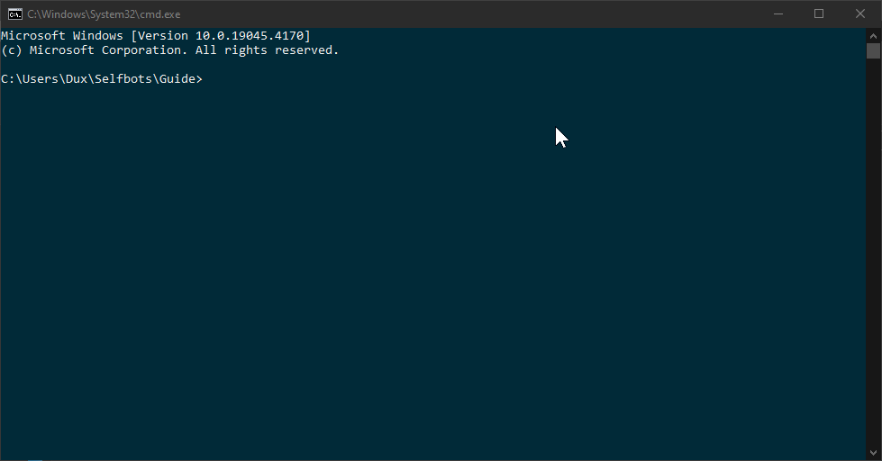

# Discord-Selfbot-Guide
This guide has been written for Discord users interested in enhancing their experience with self-bots, which can automate various tasks and interactions within the platform.
- This guide primarily covers the usage of [Node.js](https://nodejs.org/en) & [discord.js-selfbot-v13](https://github.com/aiko-chan-ai/discord.js-selfbot-v13) .

## Prerequisites
- Install Node.js from [here](https://nodejs.org/en/download) (Stable).
- A code editor, preferably [Visual Studio Code](https://code.visualstudio.com/) for begginers
- A brain with enough logic.

## Setup

 Installing Node.js

- Download the stable version of Node.js from [here](https://nodejs.org/en/download).

- Install the program and check if it is installed by running `node` in the terminal.
- Trouble Shooting
   - If you recieve an error namely `'node' is not recognised...` then proceed to `C:\Program Files\nodejs` and check if `node.exe` exists.
   - If it does, then copy the path (`C:\Program Files\nodejs\node.exe`) and then place it in System environment variables > Path
   - If it does not, then it means Node.js was not installed or was installed on any other folder... Fix it

Installing Visual Studio Code

- Install the latest version of [Visual Studio Code](https://code.visualstudio.com/) .
- Make sure to check *Add to Path* during the installation!

Initiating New Project

  
- In a new folder, open command prompt
  
- Run `npm init` and press enter for every option or edit it for your needs.
  
- 

